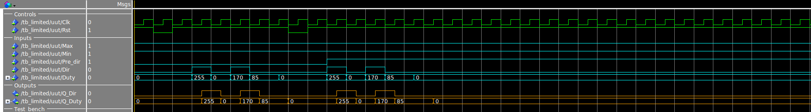
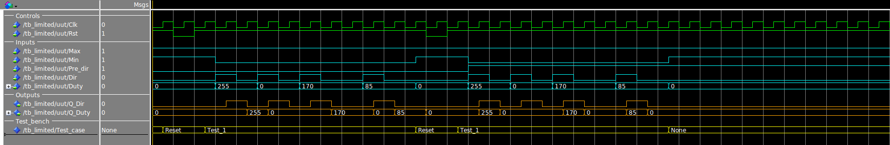
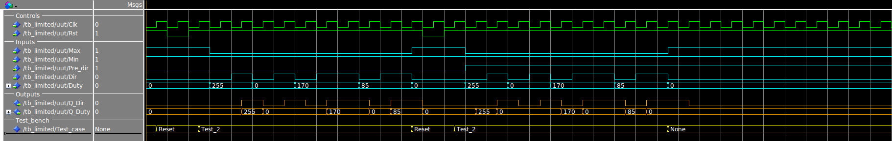

# Limited
This design is a end stop limited based on the direction output from an controller. 

  ## Generics
  > **Bit_width:** (positive)  Allows easy scaling of the Port length of the Duty and Q_Duty ports and set the length of the counter by defining the number of bits in each port. 
  
  ## IO Ports
  > **Clk:** (std_logic)    Clock port 
  > 
  > **Rst:** (std_logic)    Asynchronous reset of design 
  > 
  > **Max:** (std_logic)    End stop at maximum position   
  > 
  > **Min:** (std_logic)    End stop at minimum position   
  > 
  > **Pre_dir:** (std_logic)         Preset direction   
  >
  > **Dir:** (std_logic)             Direction input   
  >
  > **Duty:** (std_logic_vector)     Strength  input   
  >
  > **Q_Dir:** (std_logic)           Direction output response   
  >
  > **Q_Duty:** (std_logic_vector)   Strength  output response   
 
  ## RTL simulations & verification
  These simulations are executed and tested with a self-checking modular testbench (TB_Limited.vhd) and
  The RTL trace view shown in the images below is setup with a tcl file (Limited.tcl).

> ============================================================================= 
> **==============================[Dir and Duty Test]================================** 
> ============================================================================= 
> **Test 0:** 
> Case 0 | Testing the direction and Duty ports.
> 
>
> ============================================================================= 
> **==============================[Min endstop Test]================================** 
> ============================================================================= 
> **Test 1:** 
> Case 0 | Testing Min endstop with different test vectors.
> 
> ============================================================================= 
> **==============================[Max endstop Test]===============================** 
> ============================================================================= 
> **Test 2:** 
> Case 0 | Testing Max endstop with different test vectors.
> 
