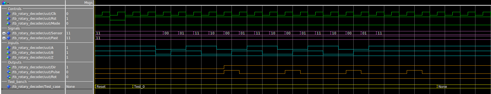
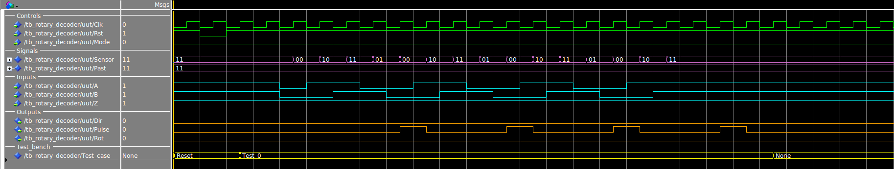
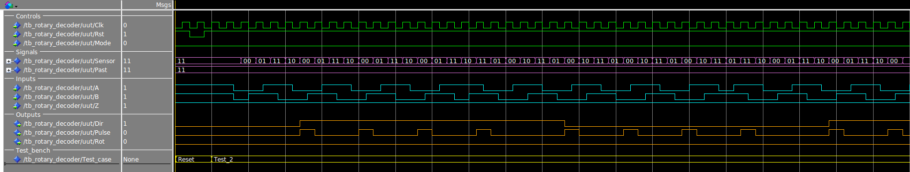
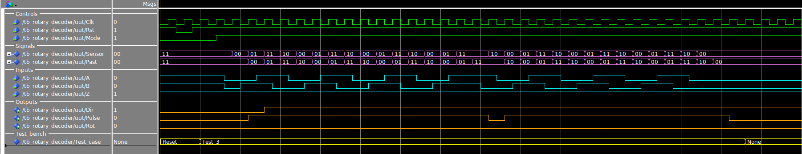
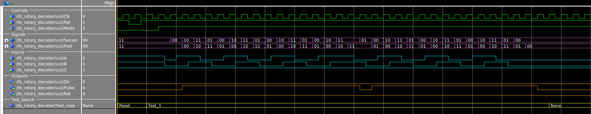
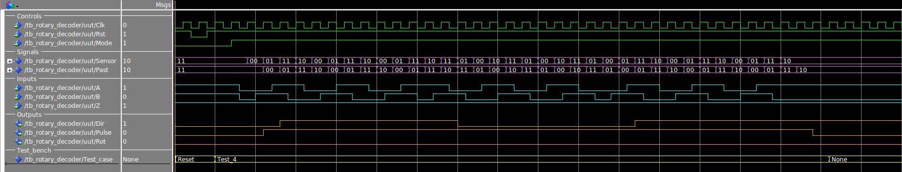

# Rotary_Decoder
  This repository is a bunch of HDL code for use across projects.

## RTL simulations
  These tests are ...

> =========================================================================================== 
> **===================================[Pulse detecting mode]=====================================** 
> =========================================================================================== 
> **Test_0:** (Mode 0) 
> This test is ...
> 
>
> **Test_1:** (Mode 0) 
> This test is ...
> 
>
> **Test_2:** (Mode 0) 
> This test is ...
> 
>
> =========================================================================================== 
> **===================================[Edge detecting mode]=====================================** 
> =========================================================================================== 
> **Test_3:** 
> This test is ...
> 
>
> **Test_4:** 
> This test is ...
> 
>
> **Test_5:** 
> This test is ...
> 
>
> =========================================================================================== 
> **===================================[Z pulse detection]=========================================** 
> =========================================================================================== 
> **Test_6:** 
> This test is ...
> 
