# Vel_Acc_Counter
  Counting velocity and acceleration as clock cycles in between pulse.

## RTL simulations
  These simulations are executed and tested by the testbench.

> =========================================================================================== 
> **==================================[Constant Velocity Test]=====================================** 
> =========================================================================================== 
> **Test 0:** 
> Case 0 | Testing constant clockwise velocity in normal mode.
> 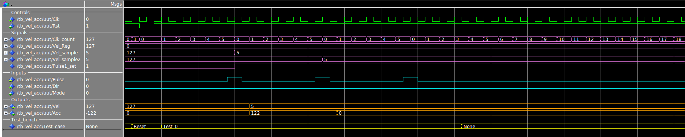
>
> Case 1 | Testing constant counterclockwise velocity in normal mode.
> 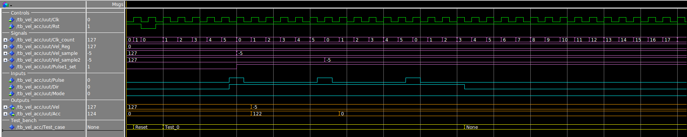
>
> Case 2 | Testing constant clockwise velocity in predictive mode.
> 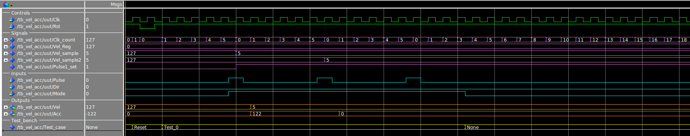
>
> Case 3 | Testing constant counterclockwise velocity in predictive mode.
> 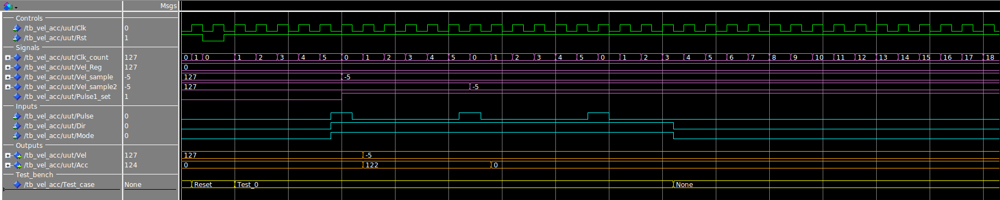
>
> =========================================================================================== 
> **================================[Increasing Acceleration Test]==================================** 
> =========================================================================================== 
> **Test 1:** 
> Case 0 | Testing increasing clockwise acceleration in normal mode.
> 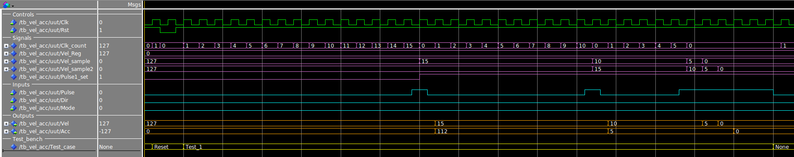
>
> Case 1 | Testing increasing counterclockwise acceleration in normal mode.
> 
>
> Case 2 | Testing increasing clockwise acceleration in predictive mode.
> 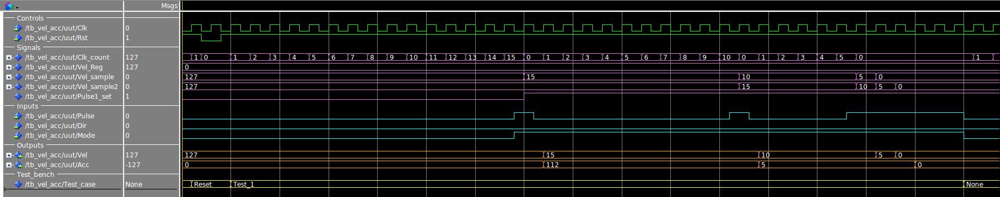
>
> Case 3 | Testing increasing counterclockwise acceleration in predictive mode.
> 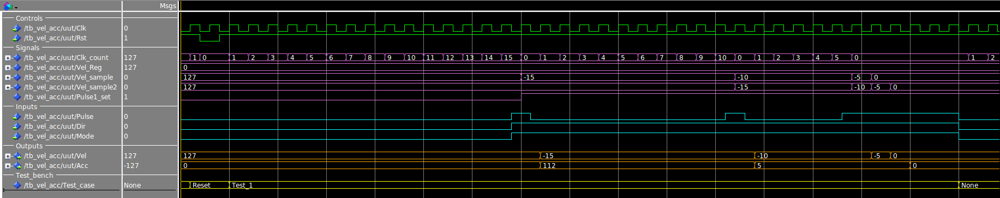
>
> =========================================================================================== 
> **===============================[Increasing Decreasing Test]====================================** 
> =========================================================================================== 
> **Test 2:** 
> Case 0 | Testing decreasing clockwise acceleration in normal mode.
> 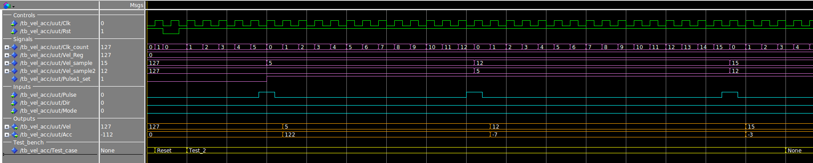
>
> Case 0 | Testing decreasing counterclockwise acceleration in normal mode.
> 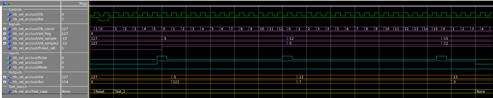
>
> Case 0 | Testing decreasing clockwise acceleration in predictive mode.
> 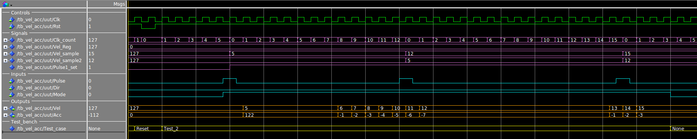
>
> Case 0 | Testing decreasing counterclockwise acceleration in predictive mode.
> 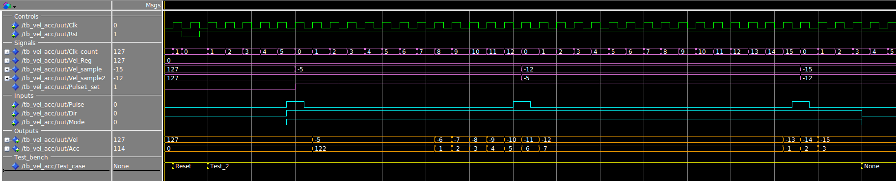
